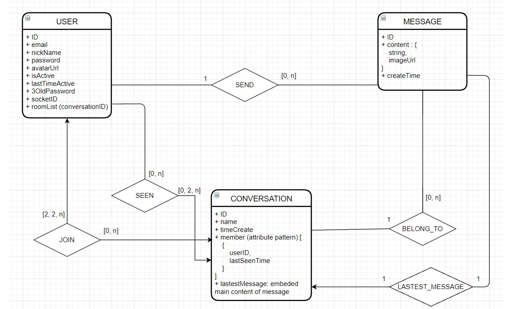

# chat app - author: Hao Le
## self-practice

**tech:**
-   api expressjs, mongoDB Atlas, cloudinary, bearer auth (jwt) + token refreshing, cors, joi
-   client reactjs, redux, redux saga, axios, socket-io

**server side validate with `joi`**
-   cách sử dụng như docs hướng dẫn
-   custom error message bằng cách thêm .messages({ //json  })
-   check ERROR list trong docs để biết key của khối json trên
-   filter các key-value gửi lên bằng 'unknown' với tham số allow = false, custom lại err mess bằng messages
-   vi messages ko support any.valid nên dùng any.only cho valid(joi.ref(...))  // check confirm password ở register
-   link: https://github.com/sideway/joi/issues/2147#issuecomment-537372635

**Dùng http-errors để create err, tiện handle err ở cuối hơn**

**Workflow**

### *User vào app*
-   client check accessToken (giả định rằng pass và thực hiện các bước sau) thêm accessToken vào `auth.accessToken`
-   client khởi tạo socketClient và lưu vào biến `socket` ở socketMiddleware
-   client emit event `setup` kèm accessToken cho server
    + server update lại socketId của user này trong DB
    + server add socketClient này vào tất cả các room (**User có 1 field là array chứa tất cả các room - conversationID**)
    + nếu tất cả thành công thì server emit lại client `setup-success`, thất bại thì emit `setup-failure`
-   nếu `setup-success` 
    + client request api để lấy user info và lưu vào global state `auth`
    + client request api để lấy list conversation của user này
        + server sẽ query Conversation theo userID và sort lại theo lastestMessage 
            + **Như vậy Conversation phải có 1 field là member dạng array chứa tất cả userID**
                + Dùng attribute pattern để indexing tiết kiệm hơn
                + Dạng: member : [{  
                    &emsp;  userID : userID, //(the index)  
                    &emsp;  lastSeenTime : time,  
                    &emsp;  user : userID-ref(User)  
                }, ...]
            + Conversation phải có 1 field là `lastestMessage`, chứa 1 message cuối cùng (để khỏi mất công query lần 2 thì embed những field cơ bản của 1 Message vào đây)
        + server sẽ paging khoảng 100 conversation 1 lần và gửi lại client
    + client nhận đc thì store đống conversation và global state `listConversation`
-   nếu `setup-failure` thì show màn hình failure

### *User vào 1 conversation*
-   User click vào 1 conversation
-   Client request lấy conversation info và update lại global state `currentConversation`
-   Client sẽ request api để lấy messages
    + client send conversationID và paging params
    + server query Message theo conversationID, sort theo time và paging
-   Client: 
    + nhận đc messages sẽ lưu vào global state `currentConversation.listMessage`
    + sort theo time và render ra UI
    + lúc render thì so sánh time của message và time seen của currentConversation.member[eachID].lastSeenTime

### *User send 1 message*
-   User typing và click send
-   Client emit event `user-send-message` gồm content, time và conversationID
-   Server: 
    + Nếu có image thì upload lên cloudinary, nhận lại public url
    + Lưu message lại, cập nhật lại lastestMessage của conversation đó `#1`
    + emit to room event `server-send-message` tin nhắn mới kèm conversation vừa update
-   Các Clients trong room:
    + Update lại global state `listConversation` bằng `#1` và sort theo lastestMessage
    + nếu `currentConversation.id === message.conversationID` thì thêm message đó vào global state `currentConversation.listMessage` và sort lại theo time
    + Cập nhật lại `currentConversation.lastestMessage` từ `#1`

### *User seen conversation*
-   Khi user trong 1 conversation và move chuột hoặc touch trên box chat area
-   Client sử dụng debounce (2s) và emit `user-seen-conversation` kèm conversationID, userID và time
-   Server:
    + Dùng redis cache time của user trong conversation `[userID + conversationID] : time`
    + Nếu time nhận đc từ client nhỏ hơn time trong cache thì kệ, nếu bé hơn thì cập nhật lại conversation `conversation.member` `#2`
    + Emit event `user-seen-conversation-success`
-   Nếu `currentConversation.id === conversation.id`
    + min(member.lastSeenTime) > currentConversation.lastestMessage.time => all user seen
    + cập nhật lại `currentConversation` theo `#2`

**ER**

**Từ ER + mongoDB pattern => các model sau:**
-   **USER**: *`ID, email, nickName, password, avatarUrl, isActive, lastTimeActive, 3OldPassword, socketID, roomList (list of conversationID)`*
-   **CONVERSATION**: *`ID, name, timeCreate, memberList (apply attribute pattern), lastestMessage (embed)`*
-   **MESSAGE**: *`ID, content, timeCreate, conversationID, senderID`*

**Handle error**
## mongoose error
-   mongoose err có các properties: message, name, code, keyValue 
-   tìm docs tụi này mà k ra!
-   mai nhớ thêm validator vào password user, sửa lại error controller để handle duplication và validation error